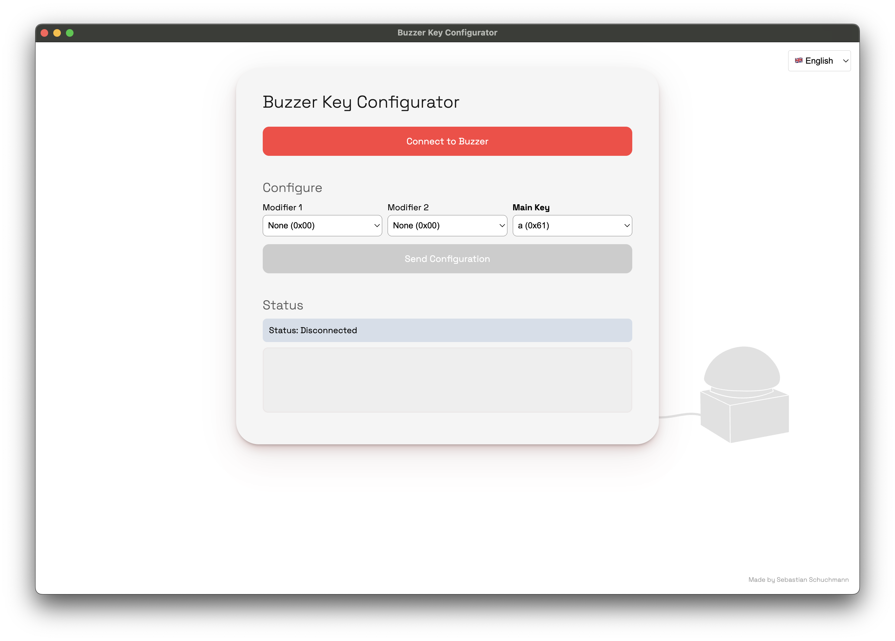

# USB Buzzer Configurator

A simple, standalone application to configure the Buzzer. This tool allows you to customize the key that your buzzer sends when pressed.

## Features

- Connect directly to your USB buzzer
- Configure modifier keys (Ctrl, Shift, Alt, etc.)
- Set any keyboard key as your buzzer's output
- Supports function keys, special keys, and standard characters
- Works on offline

## Quick Start Guide

1. **Connect your USB buzzer** to your computer
2. **Launch the application** (no installation required for portable version)
3. **Click "Connect to Buzzer"** to establish a connection
4. **Configure your key settings**:
   - Select up to 2 modifier keys (Ctrl, Shift, Alt, etc.)
   - Choose a main key (letter, number, function key, etc.)
5. **Click "Send Configuration"** to save settings to your buzzer
6. **Test your buzzer** - it should now send your configured keypress
